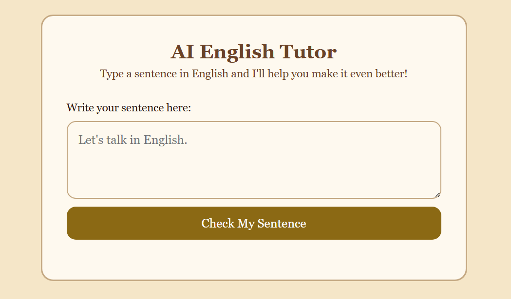
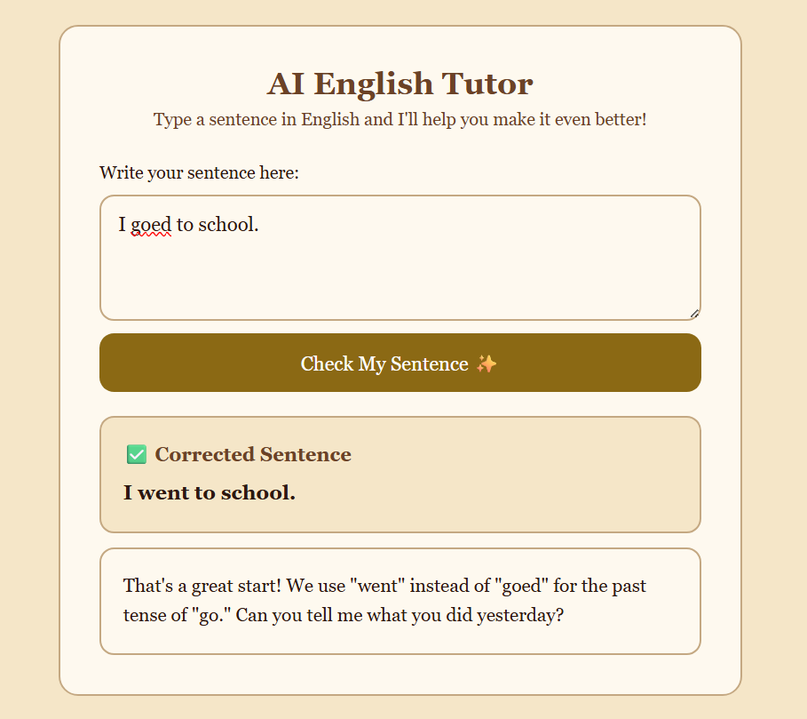

# Little English Helper

An AI-powered web app that helps children (ages 6–10) improve their English by checking sentence grammar. Built with **Flask** (backend) and **HTML/CSS/vanilla JavaScript** (frontend), powered by **Google Gemini**.

---

## 1. Project Structure

```
project/
├── app.py                 # Flask app — HTTP routes
├── requirements.txt       # Python dependencies
├── .env.example           # API key template
├── .gitignore
├── README.md
├── static/
│   ├── style.css
│   ├── script.js          # Frontend logic + client-side validation
│   └── background.png
├── templates/
│   └── index.html         # Main page (two-cell output)
└── services/
    └── ai_service.py      # AIService — Gemini API client
```

## 2. Setup Instructions

### Step 1 — Clone the repo and enter the folder
```bash
git clone https://github.com/sayfeldinn/little-english-helper.git
cd little-english-helper
```

### Step 2 — Create a virtual environment (recommended)
```bash
python -m venv venv
source venv/bin/activate      # on Windows: venv\Scripts\activate
```

### Step 3 — Install dependencies
```bash
pip install -r requirements.txt
```

### Step 4 — Configure your API key
```bash
cp .env.example .env
```
Then open `.env` and paste your real Google Gemini API key:
```
GEMINI_API_KEY=AIzaxxxxxxxxxxxxxxxxxxxx
```
Get a free key at [Google AI Studio](https://aistudio.google.com/apikey).

### Step 5 — Run the app
```bash
python app.py
```

Then open your browser at:
```
http://127.0.0.1:5000
```

---

## 3. How It Works (Architecture)

```
[ Browser: HTML/CSS/JS ]
  │  client-side validation (numbers, emojis, symbols, too-short)
  │  fetch POST /check {"sentence": "..."}
  ▼
[ Flask Backend: app.py ]
  │  validates JSON, sentence length
  │  calls ai_service.get_feedback(sentence)
  ▼
[ services/ai_service.py: AIService ]
  │  sends system + user prompt to Gemini
  ▼
[ Google Gemini API ]
  │  returns structured response (CORRECTED: / FEEDBACK:)
  ▼
[ services/ai_service.py ]
  │  parses response into {"feedback", "corrected_sentence"}
  │  or raises a typed error
  ▼
[ Flask Backend: app.py ]
  │  returns JSON with both fields, or {"error": "..."}
  ▼
[ Browser: shows corrected sentence + feedback, or error ]
```

**Why this structure?**
- `app.py` only knows about HTTP — it never talks to Gemini directly.
- `ai_service.py` only knows about AI — it never touches Flask's `request` or `jsonify`.
- This separation means you could swap in any AI provider by rewriting just one file.

---

## 4. Prompt Design

**System Prompt** — sets the AI's role: a friendly English teacher for ages 6–10. Rules include encouragement, polite corrections, follow-up questions, under 80 words, and a strict output format:

```
CORRECTED: <corrected sentence>
FEEDBACK: <encouragement, correction, practice question>
```

For nonsense/gibberish, the AI omits `CORRECTED:` and only outputs `FEEDBACK:` asking for a real sentence.

**User Prompt** — the specific sentence to analyze, wrapped in a simple instruction.

---

## 5. Client-Side Validation

Before any API call, the frontend checks for:
- Empty input
- Numbers only
- Emoji-only input
- Symbols / no English letters
- Too-short input (< 2 characters)

This saves Gemini quota by catching invalid input immediately.

---

## 6. Error Handling

| Situation                        | HTTP Status | User-Facing Message                          |
|----------------------------------|:-----------:|-----------------------------------------------|
| Empty sentence                   | 400         | "Please type a sentence before checking it!" |
| Sentence too long (>500 chars)   | 400         | "That sentence is a bit too long..."         |
| Missing API key                  | 500         | "The server is not configured correctly..."  |
| Invalid API key                  | 401         | "The AI service rejected our request..."     |
| Rate limit / quota exceeded      | 429         | "We're getting a lot of requests right now!" |
| API timeout                      | 504         | "The AI teacher is taking too long..."       |
| Network error                    | 503         | "We couldn't connect to the AI service..."   |
| Any other error                  | 502 / 500   | "Something went wrong on our end..."         |

---

## 7. Concepts

### Prompt Engineering
Carefully designing instructions sent to an AI so it reliably produces the desired output — tone, format, constraints.

### Tokens
AI models read and generate text in chunks called tokens (~¾ of a word). Input and output tokens both affect API cost. This project limits output to 150 tokens and input to 500 characters to keep costs low.

### Temperature
Controls randomness:
- **Low (0.0–0.3)** → consistent, predictable output
- **High (0.8–2.0)** → creative, varied output

This project uses **0.3** for consistent, child-friendly feedback.

---

## 8. Tech Stack

| Category  | Tools                         |
|-----------|-------------------------------|
| Backend   | Flask (Python)                |
| AI        | Google Gemini (`gemini-2.5-flash-lite`) |
| Frontend  | HTML, CSS, JavaScript         |
| Styling     | Custom CSS (Retro Paper theme)             |

---

## 9. Preview

### Home Page



### Example Result



---

## 10. License

This project is licensed under the MIT License. See the [LICENSE](LICENSE) file for details.